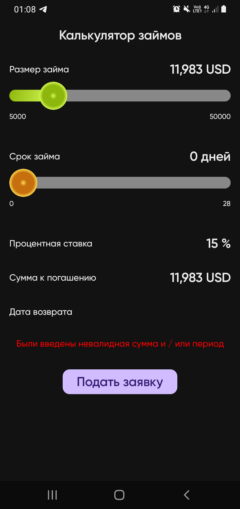
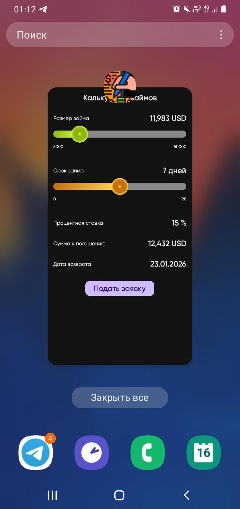
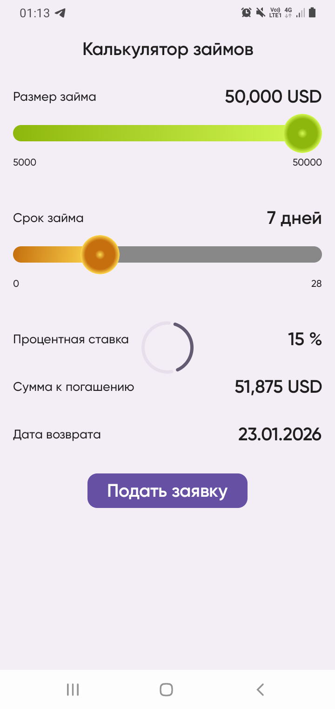
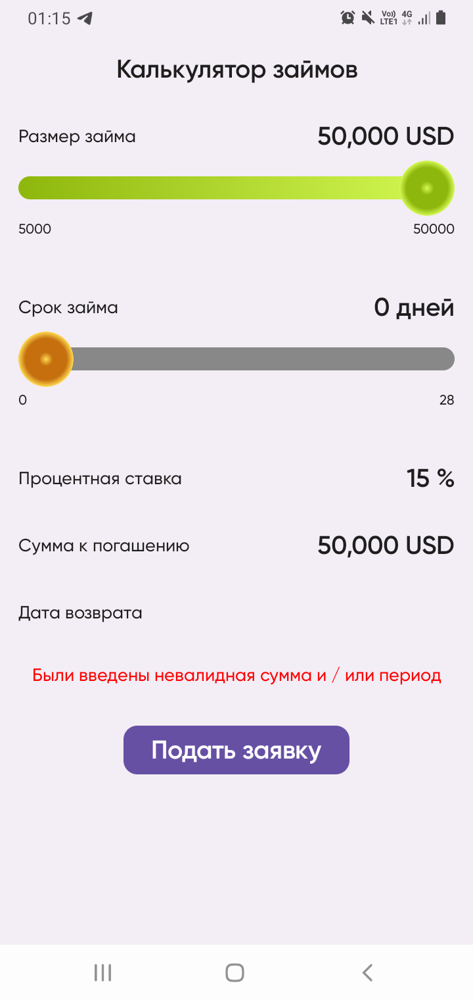
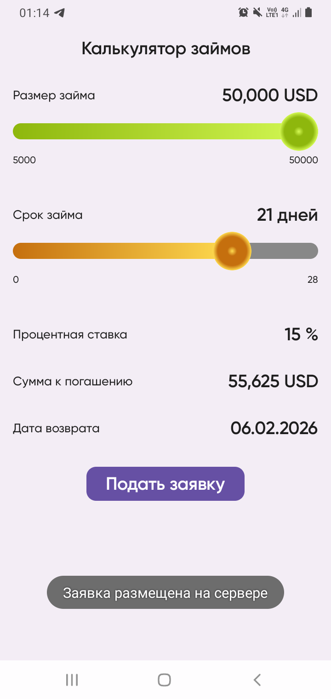
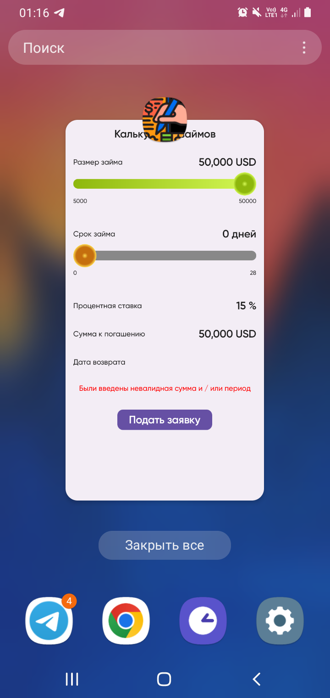

# loan_calculator
Приложение калькулятор займов:

1 Запуск и установка:
 - Можно запустить приложение в AndroidStudio, если при запуске возникнет ошибка нужно проверить
compileOption и возможно поправить пути local.properties

2 Архитектура приложения:
 - Многомодульное приложение, с возможностью простого добавления новых модулей, с добавлением
и получением новых зависимостей через граф зависимостей Dagger2.

    2.1 Базовые модули:
 - app базовый модуль с вершиной графа зависимостей в виде AppComponent, поскольку сейчас приложение
представляет собой 1 экран имплементирует этот экран без задействования feature modules.
 - injector модуль скрывает абстакции для хранения/получения зависимостей,
а также для простой установки связей между Андройд фича модулями, кроме того храннит холдер
для daggerViewModelFactory для простого внедрения VM (имеющих inject поля в конструкторе),
в любой composable функции
 - core-mvi скрывает абстракции, которые может реализовать любая mvi (tea) VM, связывает в себе
реализацию через StoreFactory и StateMachine
 - core модуль представляет domain слой clean архитектуры (общая логика, usecases, api для репозитория,
для boundaries с data слоем)
 - remote модуль представляет data слой clean архитектуры, содержит данные для работы с сетью.

3 Используемый стек технологий:
Dagger2, flow, compose, mvi, multi-modules, retrofit, Jetpack(view model)

4 Скриншоты:
 - в фолдере screenshots находятся скриншоты для тёмной и светлой тем в основных состояниях

5 apk:
 - в фолдере debug_apk лежит последний собранный debug apk файл

6 github:
https://github.com/sharktweezers/loan_calculator

7 Скриншоты:

